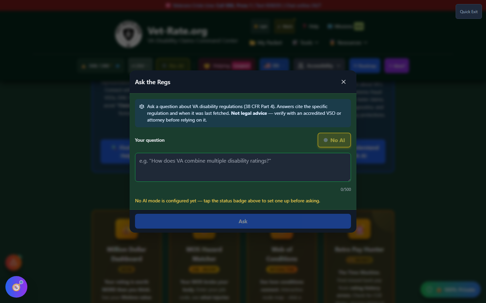

# Ask the Regs

Ask the Regs is a **direct question-and-answer interface against the CFR knowledge base**. Instead of browsing rating tables or searching for a condition, you can type a plain-language question about VA disability regulations and get an answer that cites the specific regulation it came from.

!!! warning "Keyboard Only - No Button"
Ask the Regs has **no button anywhere in the interface**. It opens only through the command palette: press **Ctrl+K** (Windows/Linux) or **Cmd+K** (Mac) from anywhere in the app, then choose "Ask the Regs" from the results.

---

## Screenshots

_Press Ctrl/Cmd+K anywhere in the app to open the command palette, then search for "Ask the Regs."_

_The Ask the Regs modal - a focused question box with a live AI-mode status badge and a not-legal-advice notice._

---

## How to Use Ask the Regs

<strong>Open the command palette</strong> - Press Ctrl+K (or Cmd+K on Mac) from any screen in the app

<strong>Search for "Ask the Regs"</strong> - Type part of the name, or browse the results list

<strong>Select it</strong> - Click the result or press Enter to open the Ask the Regs modal

<strong>Type your question</strong> - E.g., "How does VA combine multiple disability ratings?" (limited to 500 characters)

<strong>Review the answer and citations</strong> - Each answer names the specific regulation it draws from and when that regulation was last fetched

---

## What Makes It Different From Search

Vet-Rate.org's main search bar looks up specific conditions and diagnostic codes. Ask the Regs instead answers **procedural and conceptual questions** about how the rating system works - combined ratings, effective dates, secondary service connection rules, and similar "how does this work" questions that don't map to a single condition.

---

## AI &amp; Security Notes

- Ask the Regs requires an AI mode to be configured first - see [AI Command Center](ai-command-center.md). If no mode is set up, the modal tells you to configure one before asking.
- Answers cite **38 CFR Part 4** specifically and note when the underlying regulation text was last fetched.
- The tool includes built-in protection against prompt injection: if a question is flagged as an injection attempt, it is refused rather than answered.

---

## Important Disclaimer

!!! warning "Not Legal Advice"
Ask the Regs cites the regulation it draws from, but its answers are AI-generated and **not legal advice**. Always verify an answer against the official 38 CFR text and confirm with an accredited VSO or attorney before relying on it for your claim.
