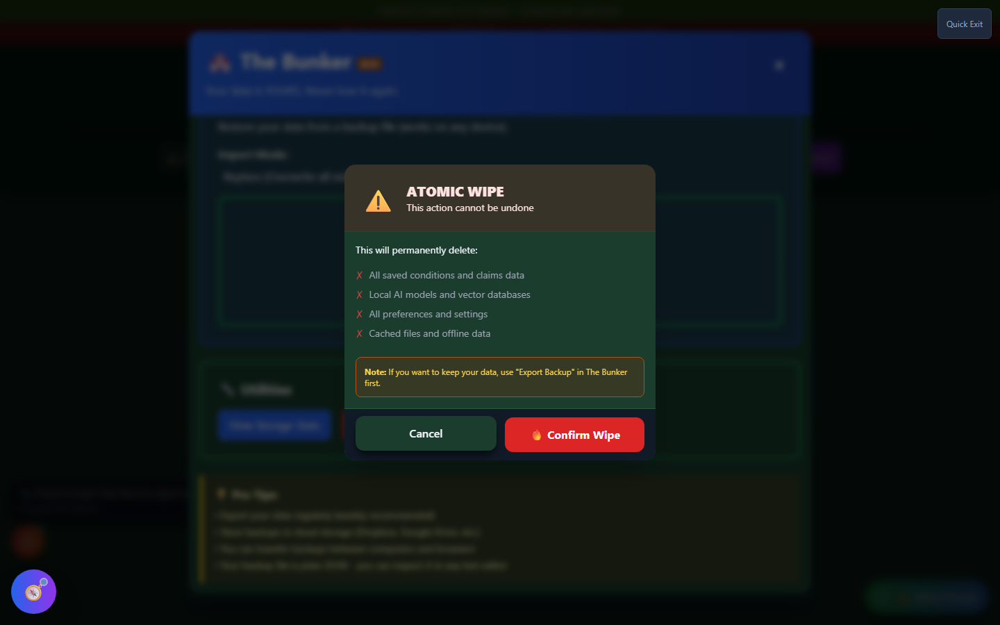

# Atomic Wipe

Atomic Wipe - "The Panic Button" - is a single-click control that **permanently and immediately erases all local Vet-Rate.org data**: every saved claim, statement, symptom log, downloaded AI model, and app preference. It lives inside [Backup Manager](backup-manager.md)'s Utilities section.

!!! danger "This Cannot Be Undone"
Atomic Wipe clears localStorage, sessionStorage, cookies, IndexedDB (including any downloaded local AI models), the browser cache, and unregisters service workers - then force-reloads the app to a completely clean state. There is **no recovery** after confirming, unless you exported a backup beforehand.

---

## Screenshots

_The Atomic Wipe confirmation screen - it lists exactly what will be deleted and reminds you to export a backup first. This screen requires an explicit click to proceed; nothing is deleted by opening it._

---

## What Gets Deleted

- All saved conditions and claims data
- Local AI models and vector databases
- All preferences and settings
- Cached files and offline data

---

## When to Use It

Atomic Wipe exists for privacy-sensitive situations:

- You're using a **shared or public computer** and want to leave no trace
- You want a clean slate and are certain you don't need the current data
- You're troubleshooting and want to rule out corrupted local storage

For routine "start over" needs where you might want the data back, Backup Manager's **"Clear All Data"** (with its own confirmation and restore point) is the less drastic option - see [Backup Manager](backup-manager.md).

---

## How to Reach It

<strong>Open Backup Manager</strong> - "The Bunker," from the home page, header Tools menu, or Settings

<strong>Scroll to Utilities</strong> - Atomic Wipe's trigger ("🔥 Clear Data") sits alongside storage stats and the restore-point control

<strong>Read the confirmation screen carefully</strong> - It lists exactly what will be deleted and reminds you to export a backup first if you want to keep anything

<strong>Confirm only if certain</strong> - There is no undo once you click "Confirm Wipe"

---

## Before You Wipe

!!! tip "Export First"
If there's any chance you'll want this data again, use **"Export Backup"** in [The Bunker](backup-manager.md) before wiping. A backup file is the only way to recover data after an Atomic Wipe.

---

## Important Disclaimer

!!! danger "Irreversible"
Atomic Wipe is intentionally difficult to trigger by accident (a confirmation screen with no default action) but, once confirmed, **is permanent**. Vet-Rate.org cannot recover your data after a wipe - it never had a copy to begin with.
