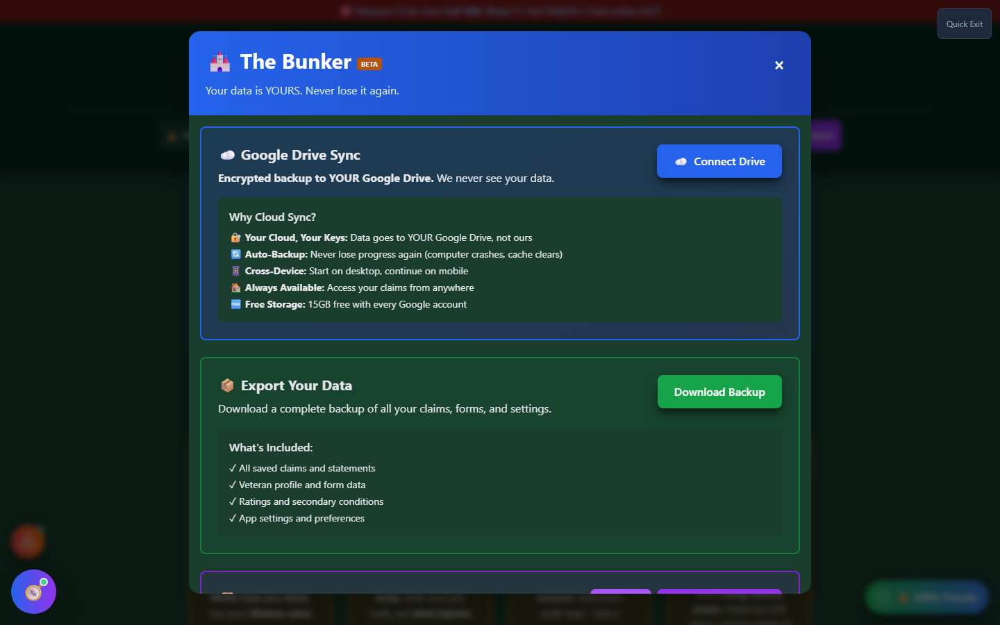
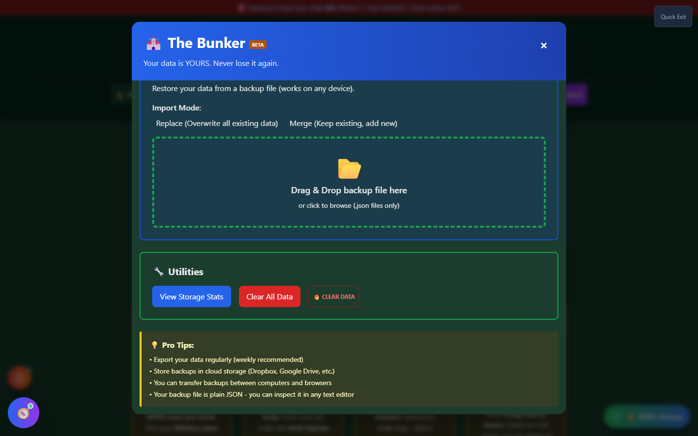

# Backup Manager (The Bunker)

Backup Manager - nicknamed **"The Bunker"** - is Vet-Rate.org's local data export and restore system.

!!! danger "This Is Your Only Copy"
Vet-Rate.org has **no server-side account** and **no cloud storage by default**. Every claim, statement, symptom log, and saved condition lives only in your browser's local storage and IndexedDB. If you clear your browser data, switch devices, or your browser's storage is corrupted, **your data is gone unless you've exported a backup here.** Exporting a backup regularly is the single most important maintenance step in using this app.

---

## Screenshots

_The Bunker's main view: export a backup file, or drag-and-drop a previous backup to restore._

_The Utilities section: storage stats, a one-click restore point, and the Atomic Wipe panic button._

---

## How to Use Backup Manager

<strong>Open Backup Manager</strong> - Home page "Support &amp; Resources," header Tools menu ("🏰 The Bunker"), or Settings &gt; Data Management

<strong>Export a backup</strong> - Click "Export Backup" to download a plain JSON file containing all your app data

<strong>Store it somewhere safe</strong> - Cloud storage (Dropbox, Google Drive), a USB drive, or email it to yourself

<strong>Restore when needed</strong> - Drag a backup file into the Import section, review the comparison of what's in the file vs. what's on this device, then choose Merge or Replace All

---

## Merge vs. Replace All

When importing a backup, you choose how it interacts with data already on the device:

| Option              | Behavior                                                                             |
| ------------------- | ------------------------------------------------------------------------------------ |
| **Merge New Items** | Keeps your current data and only adds items from the backup that don't already exist |
| **Replace All**     | Overwrites your current data entirely with the backup                                |

A restore point of your _current_ data is automatically saved before either operation, so a bad import can be undone from the Utilities section.

---

## Utilities Section

- **View Storage Stats** - see how much local data the app is holding, broken down by key
- **Restore Previous Data** - available whenever a restore point exists (created automatically before an import)
- **Clear All Data** - a confirmed, less drastic alternative to Atomic Wipe (still asks for confirmation)
- **Atomic Wipe** - the panic-button "clear everything now" control; see [Atomic Wipe](atomic-wipe.md) for details

---

## Pro Tips

!!! tip "Backup Hygiene" - Export a backup **weekly** at minimum, and always before importing or clearing data - Your backup file is plain JSON - you can inspect it in any text editor - Backups transfer cleanly between computers and browsers

---

## Important Disclaimer

!!! warning "Local-Only by Design"
Your data is stored in your browser's local sandbox. Exporting a backup creates a private file on your own computer - Vet-Rate.org never sees, stores, or transmits this data. If you want an off-device copy without manually managing files, see [Cloud Sync Manager](cloud-sync-manager.md).
