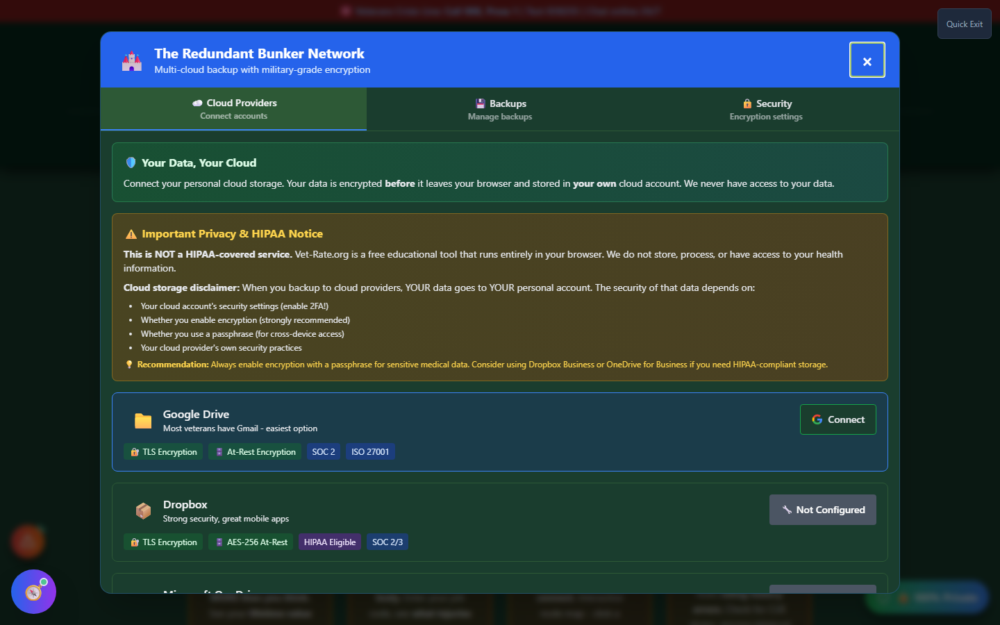

# Cloud Sync Manager (The Off-Site Bunker)

Cloud Sync Manager - "The Off-Site Bunker" - is an **optional**, **user-controlled** backup of your Vet-Rate.org data to **your own Google Drive**. It exists for the same reason as [Backup Manager](backup-manager.md): everything in this app is stored only in your browser, so a lost or reset device means lost data unless you have a copy elsewhere. Cloud Sync just automates keeping that copy off-device.

!!! va-info "Opt-In, Not Automatic"
Cloud Sync Manager does **nothing** until you explicitly sign in and choose to back up. Vet-Rate.org never uploads your data on your behalf, and there is no background syncing you didn't request.

---

## Screenshots

_Cloud Sync Manager's sign-in screen - nothing is backed up until you explicitly connect your own Google account._

---

## How It Works

<strong>Open Cloud Sync Manager</strong> - From My Packet's "Connect Google Drive" link, or from inside Backup Manager

<strong>Sign in with Google</strong> - Using your own Google account; Vet-Rate.org never sees your Google credentials

<strong>Save a backup</strong> - Your claim data goes directly from your browser to your Google Drive

<strong>Restore from any device</strong> - Sign in again on a different device or after a fresh browser install to pull your backup back down

---

## Where Your Data Goes

The panel is explicit about the data path: backups are **encrypted and saved to YOUR Google Drive**, and go **directly from your browser to your cloud** - Vet-Rate.org's own servers are never in that path. If your computer is lost or damaged, your claim data survives in your own Drive account.

---

## Important Disclaimer

!!! warning "Beta Feature"
Cloud Sync Manager is labeled **BETA** in the app. Treat it as a convenience layer on top of - not a replacement for - manually exporting a backup with [Backup Manager](backup-manager.md). Google account access and API behavior are outside Vet-Rate.org's control, so keep a local backup as well.
