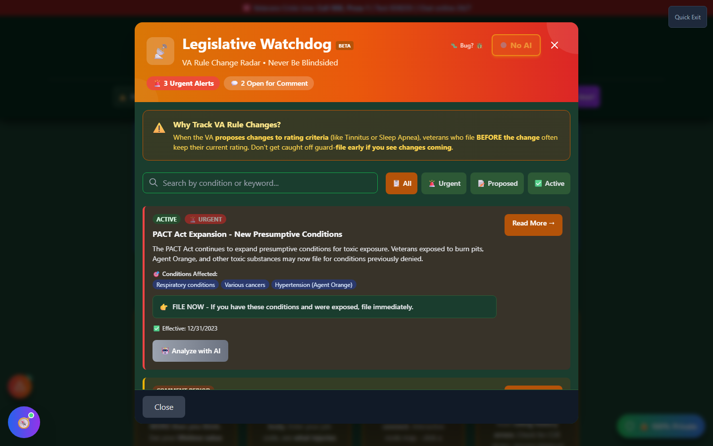

# Legislative Watchdog

Legislative Watchdog - "The Rule Change Radar" - monitors the **Federal Register** for proposed and finalized changes to 38 CFR (the VA's regulations) that could affect disability ratings. It exists because rule changes - like the proposed changes to Tinnitus and Sleep Apnea ratings - can catch veterans off guard if they don't file before a change takes effect.

---

## What It Tracks

Legislative Watchdog watches Federal Register entries for keywords tied to VA disability ratings, including:

- Schedule for Rating Disabilities (VASRD) and 38 CFR Part 4
- Presumptive conditions and toxic exposure (PACT Act)
- Specific high-interest topics: tinnitus, sleep apnea, mental disorders, musculoskeletal and neurological conditions, TBI

Each alert shows a **status** (proposed rule, comment period, under review, final rule, or active), an **urgency** level, the conditions it affects, and a recommended action.

---

## Screenshots

_Legislative Watchdog's alert feed - each card shows status, urgency, affected conditions, and a recommended action._

---

## How to Use Legislative Watchdog

<strong>Open Legislative Watchdog</strong> - From the home page "Support &amp; Resources" section, the header's "📡 Watch" quick-pill (visible on every screen), or the header Tools menu

<strong>Review the alert list</strong> - Sorted by urgency, with high-urgency items (like active PACT Act expansions) at the top

<strong>Check affected conditions</strong> - See whether a pending change touches a condition you have or plan to claim

<strong>Read the recommended action</strong> - E.g., "FILE NOW" for time-sensitive presumptive expansions, or "MONITOR" for proposals still in comment period

<strong>Follow the source link</strong> - Each alert links to the underlying Federal Register document or VA.gov page for full detail

---

## Where the Data Comes From

Legislative Watchdog pulls from, in order of preference:

1. A **weekly snapshot** fetched from the Federal Register API and refreshed by an automated pipeline
2. The **live Federal Register API** directly, if the snapshot is missing or more than 14 days old
3. A small set of **curated updates** (like the PACT Act expansion) as a fallback when neither source is available

This means the alert list reflects real, publicly filed Federal Register documents - not AI-generated predictions.

---

## Important Disclaimer

!!! warning "Educational Tool"
Legislative Watchdog surfaces public regulatory activity for awareness; it is not legal advice and does not predict whether a proposed rule will actually be finalized. If a pending change might affect your claim, discuss timing with a VA-accredited VSO or attorney before deciding when to file.
