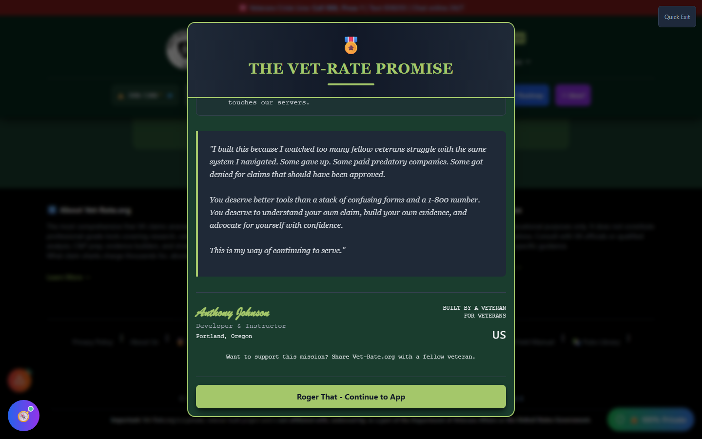

# Mission Protocol

Mission Protocol - **"The Vet-Rate Promise"** - is a trust and onboarding overview: a direct statement from the developer (a fellow service-disabled veteran) about why the app exists and what it commits to. It functions as the app's "about the mission" page rather than a functional tool.

!!! note "Footer Only"
Mission Protocol has no button in the header, home page, or Tools menu. It is reachable **only from the footer**, via the **"🎖️ Our Promise"** link at the bottom of every page.

---

## Screenshots

_Mission Protocol's "Standing Orders": zero cost, zero tracking, 100% privacy._

---

## What's Inside

The Promise is organized around three standing commitments:

| Standing Order       | Commitment                                                                                       |
| -------------------- | ------------------------------------------------------------------------------------------------ |
| 💵 **Zero Cost**     | No hidden fees, no premium tiers, no "pay to unlock" features                                    |
| 🔒 **Zero Tracking** | No accounts, no cloud storage of your data, no analytics on your medical information             |
| 🛡️ **100% Privacy**  | All AI processing that can happen locally does - your records never touch Vet-Rate.org's servers |

It also includes a personal statement from the developer explaining the motivation behind building the app, and a signature block establishing that a real, service-disabled veteran built it.

---

## How to Open Mission Protocol

<strong>Scroll to the footer</strong> - On any page in the app

<strong>Click "🎖️ Our Promise"</strong> - In the footer's link bar

---

## Why It's Worth Reading

Mission Protocol is the clearest single statement of Vet-Rate.org's privacy and cost commitments - useful to point to if you're deciding whether to trust the app with sensitive claim information, or explaining to another veteran why this tool is different from paid "claim shark" services.
