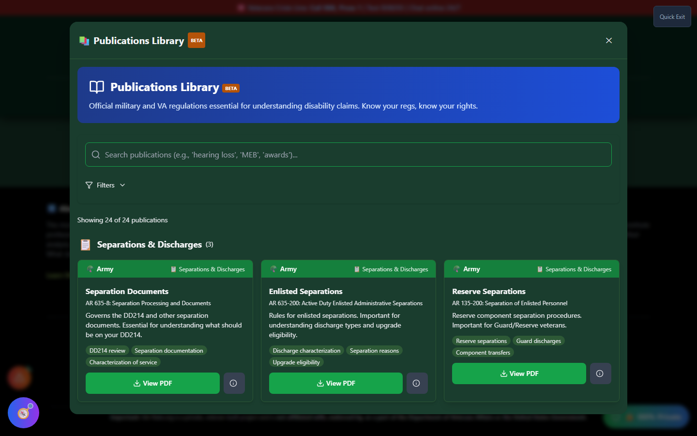

# Publications Library (BETA)

The Publications Library - **"Know your regs, know your rights"** - is a reference library of official military and VA publications relevant to disability claims: separation and discharge documentation, medical standards, disability evaluation manuals, awards references, and VA rating/claims guidance.

!!! note "Footer Only, and Marked BETA"
Publications Library has no button in the header, home page, or Tools menu. It is reachable **only from the footer**, via the **"📚 Pubs Library"** link. The app itself labels this feature **BETA**.

---

## Screenshots

_Publications Library's card grid - each entry is tagged by branch and category, with a direct link to view the document._

---

## What's Inside

Each publication card shows:

- **Branch** - Army, Navy, Air Force, Marines, Coast Guard, Space Force, DoD, or VA
- **Category** - Separations &amp; Discharges, Disability Evaluation, Medical Standards, Awards &amp; Decorations, Occupational Information, VA Rating &amp; Claims, or Assignments &amp; Deployments
- **"Use for" tags** - what the publication is typically referenced for
- A direct link to **view the PDF** (locally hosted) or an **external link** to the official source when no local copy is bundled

---

## How to Use the Publications Library

<strong>Scroll to the footer</strong> - On any page in the app

<strong>Click "📚 Pubs Library"</strong> - In the footer's link bar

<strong>Search or filter</strong> - By branch, category, or keyword

<strong>Open a publication</strong> - View the PDF directly, or follow the external link to the official source

---

## Important Disclaimer

!!! warning "Beta - Verify Against the Official Source"
This library is labeled BETA in the app. Publication versions and links can go stale as the military and VA update their references. When a publication is claim-critical, confirm you're looking at the current official version through the linked source or your service's official publication index.
