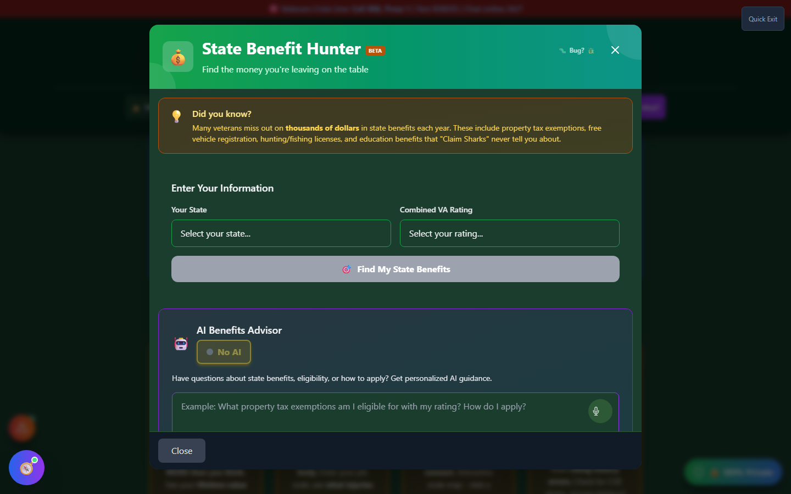
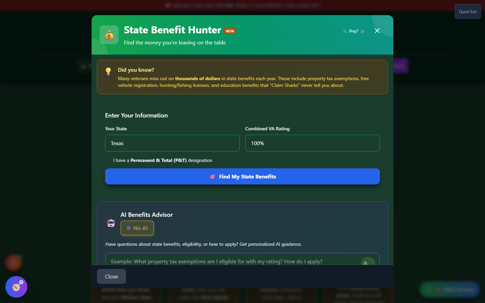

# State Benefit Hunter

State Benefit Hunter - "Money on the Table" - finds **state-level veteran benefits** that many veterans never learn about. These are separate from, and in addition to, your federal VA disability compensation.

---

## Federal vs. State Benefits

Your VA disability rating (the percentage covered elsewhere in this manual) determines your **federal** monthly compensation. Most U.S. states _also_ offer their own veteran benefits, often tied to that same disability rating, including:

- **Property tax exemptions** - potentially thousands of dollars per year
- **Free or discounted vehicle registration** and disabled-veteran (DV) plates
- **Education and tuition waiver programs**
- **Hunting and fishing license discounts**
- **Employment preferences**
- **Additional healthcare programs** beyond federal VA care
- **Housing assistance programs**

These benefits are set by **state law**, not the VA, so eligibility rules and dollar values vary widely by state.

---

## Screenshots

_Select your state and combined VA rating to search state-specific benefits._

_Results for Texas at 100% - each card shows the benefit category, estimated value, and eligibility requirement._

---

## How to Use State Benefit Hunter

<strong>Open State Benefit Hunter</strong> - From the home page "Support &amp; Resources" section ("🎯 Find My State Benefits") or the header Tools menu

<strong>Select your state</strong> - Choose from the dropdown of all 50 states plus DC

<strong>Select your combined VA rating</strong> - 0% through 100%, including a 100% Permanent &amp; Total (P&amp;T) option

<strong>Check the P&amp;T box if applicable</strong> - Some state benefits require P&amp;T status specifically, not just a 70%+ rating

<strong>Click "Find My State Benefits"</strong> - Results are filtered to what you actually qualify for at your state and rating

---

## Understanding the Results

Each benefit card shows:

- **Category icon** - Property Tax 🏠, Vehicle 🚗, Education 🎓, Recreation 🎣, Employment 💼, Healthcare 🏥, or Housing 🏡
- **Estimated value** - a dollar figure or description of the benefit
- **Eligibility requirement** - the minimum rating (or P&amp;T status) needed
- **💰 Money Saved** or **🎯 Lifestyle** badges highlighting especially valuable or notable benefits

---

## Data Verification Status

!!! warning "Verification Status Varies by State"
State Benefit Hunter's data is sourced from official state `.gov` sites. As of this writing, a subset of states (including Texas, California, and Florida) has been **manually verified** against current law; the remainder is built from state benefit profiles that have not yet received the same manual review.

    **Always confirm current eligibility and dollar amounts directly with your state's veterans affairs department or tax assessor before relying on a figure shown here** - state laws change, and this tool is a starting point for research, not a guarantee.

---

## Important Disclaimer

!!! warning "Educational Tool"
State Benefit Hunter is for research purposes only. It does not file claims or applications on your behalf. Each state benefit typically requires its own separate application process through your state or county veterans affairs office.
