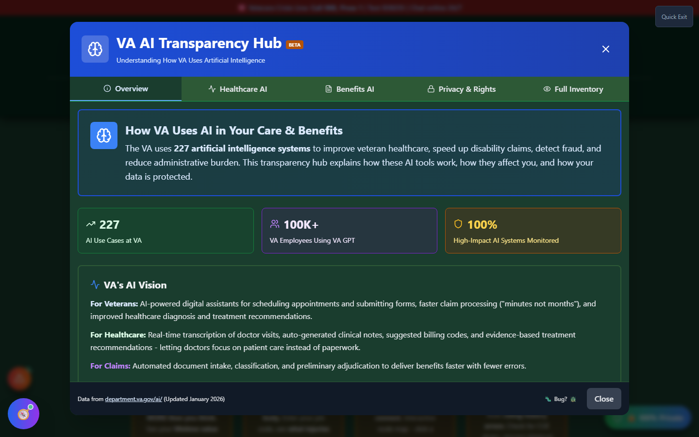
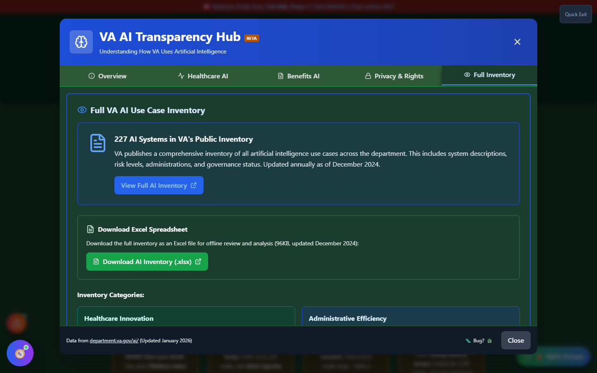

# VA AI Transparency Hub

The VA AI Transparency Hub is an **education and transparency resource** about how the **U.S. Department of Veterans Affairs itself** uses artificial intelligence - in healthcare, claims processing, and fraud detection. It is not one of Vet-Rate.org's own AI-powered tools; it exists to help you understand AI systems that may already be part of your VA experience, based on the VA's own published AI use-case inventory.

!!! note "This Is About the VA's AI, Not Vet-Rate.org's AI"
If you want to understand how _this app's_ AI features work and where your data goes, see [AI Command Center](ai-command-center.md) instead. This page covers the VA's own AI systems.

---

## Screenshots

_The Overview tab summarizes VA's Trustworthy AI Framework and the governance protections that apply to every VA AI system._

_The Full Inventory tab lists individual VA AI use cases from the department's published inventory._

---

## What's Inside

The Hub is organized into tabs:

| Tab                      | Covers                                                                                        |
| ------------------------ | --------------------------------------------------------------------------------------------- |
| **Overview**             | VA's AI governance framework and high-level protections                                       |
| **Healthcare AI**        | Clinical AI systems - e.g., opioid overdose risk detection, AI-assisted colonoscopy screening |
| **Benefits AI**          | Claims-related AI - e.g., payment fraud detection, document classification/routing            |
| **Privacy &amp; Rights** | What protections apply to your data when the VA uses AI                                       |
| **Full Inventory**       | The VA's complete published list of AI use cases                                              |

---

## Why This Matters to Your Claim

Several VA AI systems directly touch the disability claims process, including:

- **Claims Document Classification** - AI that automatically organizes and routes documents in your claims file to speed up processing
- **Payment Fraud Detection** - AI that flags potentially fraudulent changes to your direct deposit information, protecting your benefit payments

Both are described by the VA as requiring **human oversight** for any high-impact decision - AI assists staff, but does not make final determinations alone under VA's OMB M-25-21 compliance and Trustworthy AI Framework.

---

## Governance Protections

The Hub summarizes the safeguards the VA says apply to its AI systems:

- **Human oversight required** for high-impact AI decisions
- **Public inventory** - all VA AI use cases are published and updated annually
- **No unapproved data sharing** - your PII and health data can only be used by VA-approved, security-reviewed AI tools
- **AI Ethics Assessment Tool** - used to anticipate and mitigate risks to veteran rights and safety

---

## Important Disclaimer

!!! warning "Informational Only"
This Hub summarizes publicly available VA documentation (department.va.gov/ai/) for educational purposes. It is not an official VA publication, does not reflect real-time changes to VA AI policy, and should not be treated as a substitute for the VA's own disclosures. If you have concerns about how AI was used in your specific claim, ask your VSO or the VA directly.
