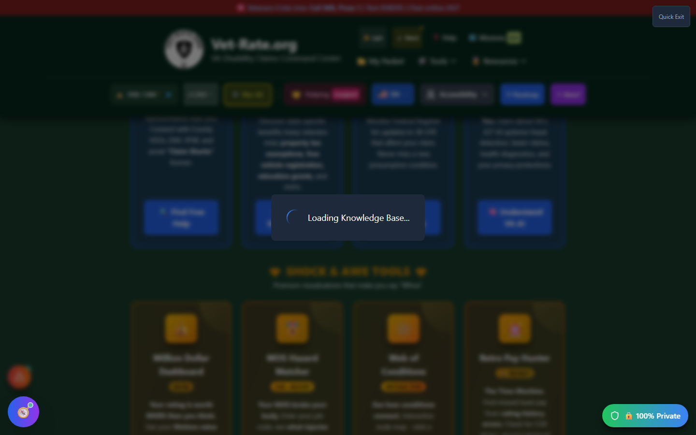

# VKB Timeline

VKB Timeline is the **chronological view** of the [Veteran Knowledge Base](vkb-viewer.md) - every document the app has learned from, laid out in the order it was added, with version history for documents that were uploaded more than once.

---

## Screenshots

_The VKB Timeline's loading screen - it briefly appears while the Knowledge Base initializes, then gives way to the chronological document list described below._

---

## What It Shows

- A **chronological list** of every document contributing to your Veteran Knowledge Base
- **Filter by category** to focus on one document type at a time
- **Version indicators** (v1, v2, etc.) when the same document type has been uploaded more than once
- **Sort order** toggle between newest-first and oldest-first
- **Compare versions** side-by-side when multiple versions of a document exist
- Click any document to jump into the [VKB Viewer](vkb-viewer.md) for full detail

---

## How to Open VKB Timeline

On phone-width screens, open the hamburger menu and choose **"📅 Document Timeline."** On a desktop-width screen there is currently no dedicated header button for the Timeline specifically - the [VKB Viewer](vkb-viewer.md) (Header Tools menu → "📚 Knowledge Base") is the reliable desktop entry point into the same underlying Veteran Knowledge Base.

---

## Why It's Useful

If you've uploaded a claims file, a decision letter, or medical records more than once (e.g., an updated C-file after a new decision), the Timeline is the fastest way to see what changed and when - rather than hunting through the sectioned VKB Viewer for the latest version of each fact.

---

## Important Disclaimer

!!! warning "Stored Locally, Like Everything Else"
The Timeline reflects documents stored in your browser's local Veteran Knowledge Base - see [Backup Manager](backup-manager.md) for why exporting a backup matters before clearing browser data.
