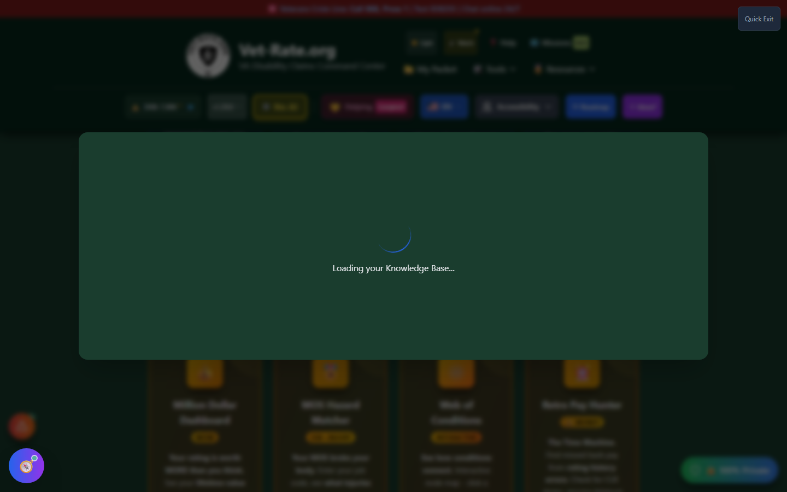

# VKB Viewer (Veteran Knowledge Base)

The **Veteran Knowledge Base (VKB)** is Vet-Rate.org's internal record of everything the app has learned about your case so far - extracted from documents you've uploaded and information you've entered across every tool you've used. The VKB Viewer is the organized, editable interface for that record.

---

## Screenshots

_The VKB Viewer's loading screen - it briefly appears while the Knowledge Base initializes, then gives way to the sectioned view described below._

---

## What's Inside

The Viewer organizes everything it knows into sections:

| Section               | Contains                                                     |
| --------------------- | ------------------------------------------------------------ |
| 👤 Personal Info      | Name, date of birth, contact details                         |
| 🎖️ Service History    | Branch, MOS, deployments, service dates                      |
| 🏥 Medical Conditions | Conditions identified from your activity in the app          |
| 💊 Medications        | Medications referenced in uploaded documents or logs         |
| 🩺 Treatments         | Treatment history extracted from evidence                    |
| 📅 Evidence Timeline  | Chronological events tied to your claim                      |
| 📄 Documents          | Files you've uploaded that fed into the VKB                  |
| 🤖 AI Insights        | Patterns or connections the AI has surfaced across your data |

Every field is **editable** - if something was extracted incorrectly, or you want to add detail, you can correct it directly.

---

## How Information Gets Into the VKB

You don't fill this out manually from scratch. The VKB accumulates automatically as you use other tools - uploading a document to C-File Analyzer, logging a symptom, saving a claim, or generating a statement all feed information into it. The Viewer is where you review, correct, and export what's been collected.

---

## How to Open the VKB Viewer

<strong>Open the header Tools menu</strong> - Click "🛠️ Tools," then "📚 Knowledge Base" under Support &amp; Resources

<strong>Review each section</strong> - Click through the tabs to see what's been captured

<strong>Edit as needed</strong> - Toggle edit mode to correct or add information directly

For a chronological, document-by-document view instead of the sectioned editor, see [VKB Timeline](vkb-timeline.md).

---

## Important Disclaimer

!!! warning "Stored Locally, Like Everything Else"
The VKB lives in your browser's local storage, the same as every other Vet-Rate.org tool - see [Backup Manager](backup-manager.md) for why exporting a backup matters. It is a research and organization aid, not an official VA record.
