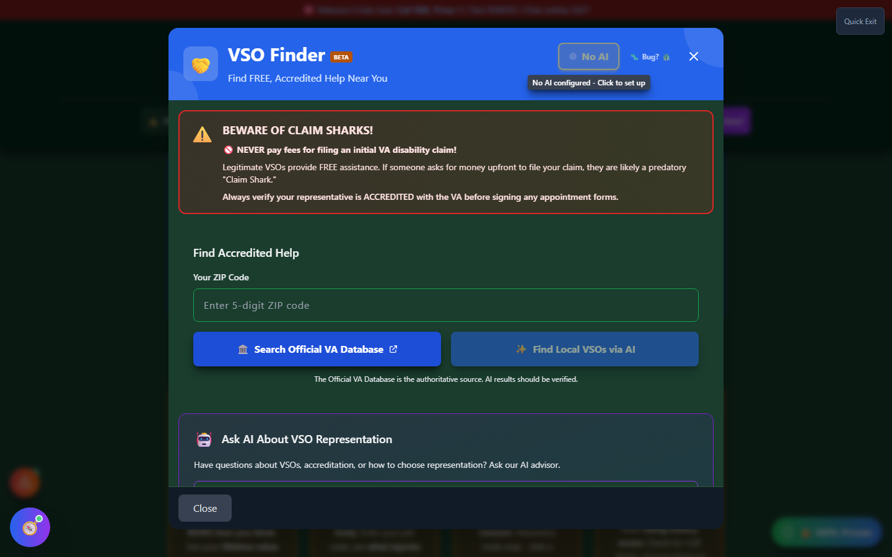

# VSO Finder

VSO Finder - "The Honest Broker" - helps you find **free, accredited representation** for your VA disability claim. It exists to prove that Vet-Rate.org isn't a "claim shark": every tool in this app is free, and this one actively points you toward other free help.

---

## What Is a VSO?

A **Veteran Service Officer (VSO)** is a trained, VA-accredited representative who helps veterans file, develop, and appeal disability claims - at **no cost to you**. VSOs work for organizations that are legally accredited by the VA to represent claimants, including:

- **County Veterans Service Officers (CVSOs)** - local government offices, often the fastest to reach
- **State VA Offices** - state-level veteran affairs departments
- **National Service Organizations** - DAV, VFW, American Legion, and similar accredited nonprofits

Because VSOs are accredited, they're legally permitted to view your claims file, correspond with the VA on your behalf, and file appeals for you - the same access a paid attorney would have, without the fee.

!!! va-info "Why Vet-Rate.org Recommends a VSO"
This app is a research and organization tool, not a substitute for representation. The standing guidance throughout Vet-Rate.org is to **seek a VSO or accredited attorney** before filing or appealing a claim. VSO Finder is the direct, in-app way to act on that guidance.

---

## Screenshots

_The VSO Finder launcher: enter your ZIP code, then search the official VA accredited-representative database._

---

## How to Use VSO Finder

<strong>Open VSO Finder</strong> - From the home page "Support &amp; Resources" section ("🔍 Find Free Help"), or the header Tools menu

<strong>Enter your ZIP code</strong> - Used only to search the official VA database; nothing is transmitted beyond that lookup

<strong>Search the Official VA Database</strong> - Pulls current accredited County VSOs, State VA Offices, and National Organizations near you

<strong>Review results</strong> - Each organization card shows address, phone, and website when available

<strong>Contact them directly</strong> - Reach out to schedule an appointment; VSOs typically work on a first-come, first-served or appointment basis

---

## Avoiding "Claim Sharks"

VSO Finder exists specifically to counter predatory "claim consultants" who charge veterans thousands of dollars for help that is available for free.

!!! danger "Never Pay for Claim Help"
Legitimate, VA-accredited VSOs **never charge a fee** to help you file or develop a claim. If anyone asks you to pay upfront for claims assistance, that is a red flag. Always verify a representative's accreditation before working with them.

---

## Important Disclaimer

!!! warning "Educational Tool"
VSO Finder surfaces publicly available contact information; it does not vet individual representatives or guarantee availability. Always confirm current accreditation and contact details directly with the organization, and consult a VA-accredited VSO or attorney before making claims decisions.
