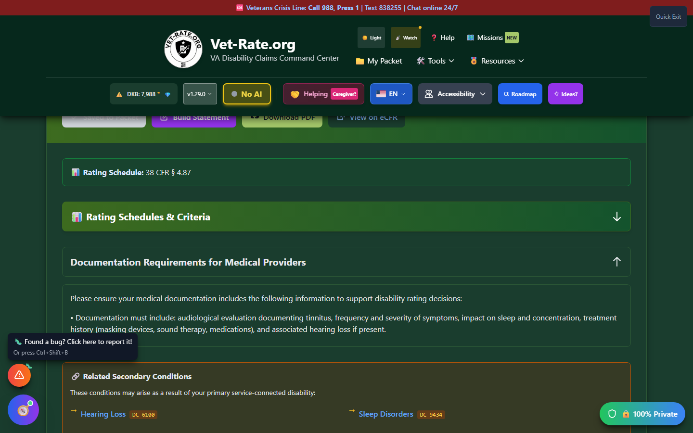
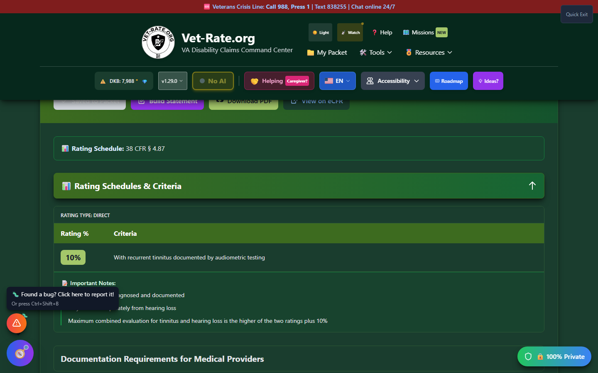

# Disability Details

When you click a search result card, a comprehensive details panel opens showing all information about the selected condition.


_The details panel opens directly below the search results, with Save to Packet, Build Statement, Download PDF, and View on eCFR actions._

---

## Details Panel Overview

The details panel expands below the search results and contains:

1. **Header Section** - Condition name, code, and action buttons
2. **PACT Act Info** - (if applicable) Presumptive condition information
3. **Rating Schedule** - CFR reference for this condition
4. **Rating Criteria** - Expandable table with all percentage criteria
5. **Secondary Conditions** - Related conditions that may qualify
6. **Documentation Tips** - Evidence guidance for your claim
7. **VA Resources** - Direct links to relevant VA services

---

## Header Section

### Title Area

- **Condition Name** - Large, bold heading
- **PACT Act Badge** - Orange badge if presumptive condition
- **Diagnostic Code** - Displayed below the name

### Action Buttons

| Button                  | Function                                          |
| ----------------------- | ------------------------------------------------- |
| **Save to Packet**      | Add condition to My Packet for tracking           |
| **Build Statement**     | Open Nexus Builder to create supporting statement |
| **Download PDF**        | Generate comprehensive PDF report                 |
| **View on eCFR**        | Open official regulation on eCFR.gov              |
| **💚 Back the Mission** | Support Vet-Rate.org development                  |
| **Close (X)**           | Close the details panel                           |

---

## PACT Act Information

If the condition is covered under the PACT Act:

<div class="feature-card">
<h4>🏛️ PACT Act Presumptive Condition</h4>
<p>This condition may qualify as a <strong>presumptive condition</strong> under the PACT Act, meaning you may not need to prove a service connection.</p>
</div>

The info card includes:

- **What it means** - Explanation of presumptive status
- **Eligibility** - Who may qualify
- **Next steps** - How to file a claim
- **Resources** - Links to PACT Act information

---

## Rating Schedule

The rating schedule section shows:

```
📊 Rating Schedule: 38 CFR § [Section Reference]
```

This tells you which section of the Code of Federal Regulations governs ratings for this condition.

---

## Rating Criteria Section

This expandable section contains the **official VA rating criteria** for the condition.

### Opening Rating Criteria

Click the **"📊 Rating Schedules & Criteria"** header to expand.


_Expanding the section reveals the rating type, percentage table, and any special notes - all sourced from 38 CFR Part 4._

### Rating Type Badge

At the top, you'll see the rating type:

| Type                 | Meaning                     |
| -------------------- | --------------------------- |
| **percentage-based** | Standard percentage ratings |
| **formula-based**    | Uses a specific calculation |
| **analogous**        | Rated under another code    |
| **range-of-motion**  | Based on joint movement     |

### Rating Instructions

Some conditions have special instructions:

!!! warning "Rating Instructions"
Some conditions are "rated as" another condition or have specific evaluation rules. Always read these instructions carefully.

### Percentage Table

The main rating table shows:

| Rating % | Criteria                                   |
| -------- | ------------------------------------------ |
| **100%** | Most severe symptoms meeting 100% criteria |
| **70%**  | Symptoms meeting 70% criteria              |
| **50%**  | Symptoms meeting 50% criteria              |
| **30%**  | Symptoms meeting 30% criteria              |
| **10%**  | Symptoms meeting 10% criteria              |
| **0%**   | Service-connected, minimal symptoms        |

!!! tip "Reading the Criteria" - Criteria are listed from **highest to lowest** percentage - Each row describes **exactly** what symptoms/impairment qualify for that rating - You qualify for a rating if you meet **all** the criteria for that level

### Special Notes

Additional notes may appear at the bottom:

- **Notes** - Important clarifications
- **Considerations** - Factors the examiner should evaluate
- **Combined ratings** - How multiple conditions interact

---

## Secondary Conditions Section

If the condition has known secondary conditions, you'll see a list of related conditions that may develop due to your primary condition.

### Example Secondary Conditions

For **PTSD (9411)**, secondary conditions might include:

- Major Depressive Disorder
- Sleep Apnea
- Hypertension
- Substance Use Disorder

### Clicking Secondary Conditions

When you click a secondary condition:

1. The view navigates to that condition's details
2. The previous condition remains available via back navigation

---

## Documentation Tips Section

Expandable section with guidance on documenting your condition:

### What This Section Covers

- **Medical evidence needed** - Types of documentation
- **Service connection tips** - How to establish nexus
- **C&P exam preparation** - What to expect and how to prepare
- **Common mistakes** - Pitfalls to avoid

---

## VA Resources Section

Quick links to relevant VA resources:

### Emergency Resources

| Resource                 | Contact        |
| ------------------------ | -------------- |
| **Veterans Crisis Line** | 988, Press 1   |
| **Homeless Vet Hotline** | 1-877-4AID-VET |

### Essential Links

- File a Disability Claim
- Check Claim Status
- Find an Accredited VSO
- Download Benefit Letters
- MyHealtheVet Medical Records
- VA Home Loans
- GI Bill Benefits
- Center for Women Veterans

---

## Using Action Buttons

### Save to Packet

<div class="step-container">
<div class="step">
Click <strong>"Save to Packet"</strong>
</div>
<div class="step">
Condition is added to your claim packet
</div>
<div class="step">
Button changes to <strong>"Saved to Packet"</strong> (disabled)
</div>
<div class="step">
Access saved conditions in <strong>My Packet</strong>
</div>
</div>

### Build Statement

Opens the **Nexus Builder** wizard:

1. Walks you through generating a statement
2. Creates a "Statement in Support of Claim"
3. Generates a "Doctor's Cheat Sheet"
4. Allows download in multiple formats

### Download PDF

Generates a comprehensive PDF report containing:

- Condition overview
- Rating criteria table
- Documentation tips
- VA resources
- Disclaimer

### View on eCFR

Opens the official Electronic Code of Federal Regulations page for this diagnostic code on eCFR.gov.

---

## Closing Details

To close the details panel:

- Click the **X button** in the header
- Click on another search result (switches view)
- Clear the search (closes results and details)

---

## Accessibility Features

The details panel is fully accessible:

- ✅ Keyboard navigable
- ✅ Screen reader compatible
- ✅ Proper heading hierarchy
- ✅ Focus management
- ✅ High contrast support
