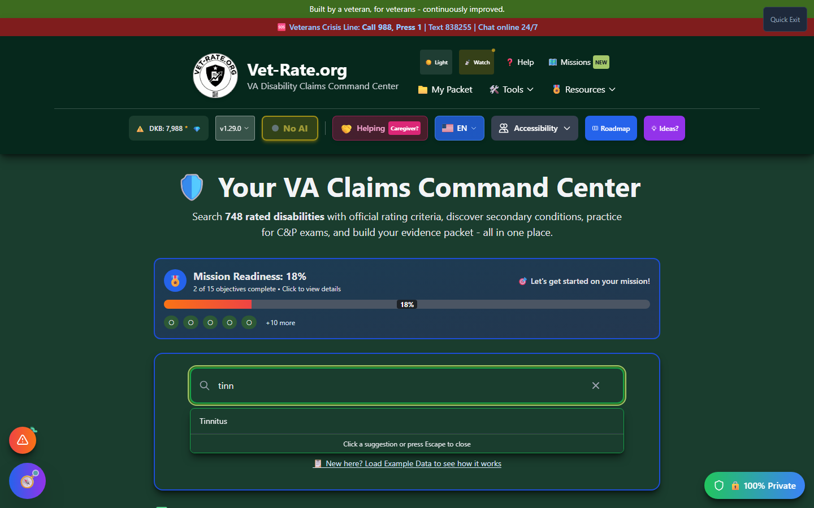

# How to Search

Learn all the ways to search Vet-Rate.org's comprehensive disability database.

---

## Using the Search Bar

The search bar is located prominently in the center of the main page.

_Auto-suggestions appear the moment you type 2+ characters - click one to jump straight to results._

### Basic Search

<strong>Click in the search bar</strong> or press <kbd>Tab</kbd> to focus it

<strong>Type your search term</strong> - condition name, code, or keyword

<strong>View auto-suggestions</strong> - appear after 2+ characters

<strong>Press Enter</strong> or click a suggestion to search

---

## Search Input Methods

### By Condition Name

Type the medical or common name of a condition:

| Input         | Finds                          |
| ------------- | ------------------------------ |
| `PTSD`        | Post-Traumatic Stress Disorder |
| `Arthritis`   | Various arthritis conditions   |
| `Migraines`   | Migraine Headaches             |
| `Tinnitus`    | Tinnitus                       |
| `Sleep Apnea` | Sleep Apnea Syndromes          |
| `Depression`  | Major Depressive Disorder      |

### By Diagnostic Code

Enter the 4-digit diagnostic code:

| Code   | Condition                      |
| ------ | ------------------------------ |
| `9411` | PTSD                           |
| `5002` | Rheumatoid Arthritis           |
| `6260` | Tinnitus                       |
| `8100` | Migraine Headaches             |
| `6847` | Sleep Apnea Syndromes          |
| `5237` | Lumbosacral or Cervical Strain |

### By Synonym or Keyword

Search using common terms or symptoms:

| Keyword                | Finds                   |
| ---------------------- | ----------------------- |
| `ringing in ears`      | Tinnitus                |
| `back pain`            | Spine conditions        |
| `anxiety attacks`      | Panic Disorder, Anxiety |
| `posttraumatic stress` | PTSD                    |
| `knee pain`            | Knee conditions         |
| `numbness`             | Neuropathy conditions   |

---

## Auto-Suggestions

As you type, auto-suggestions appear below the search bar:

### How Suggestions Work

1. **Minimum 2 characters** - Suggestions appear after typing 2+ letters
2. **Up to 8 suggestions** - The most relevant matches are shown
3. **Click to select** - Click any suggestion to search
4. **Keyboard navigation** - Use arrow keys to navigate

### Suggestion Priority

Suggestions are ranked by:

1. **Exact matches** - Condition names starting with your text
2. **Contains matches** - Condition names containing your text
3. **Code matches** - Diagnostic codes matching your text
4. **Synonym matches** - Alternative names and keywords

---

## Clearing Your Search

To clear the current search:

- **Click the X button** - Appears in the search bar when text is entered
- **Delete all text** - Manually clear the search bar
- **Press Escape** - Closes suggestions (doesn't clear text)

When cleared:

- Search results disappear
- The search bar returns to placeholder state
- Previously viewed details close

---

## Search Validation

The search bar validates input for security:

| Allowed             | Not Allowed                     |
| ------------------- | ------------------------------- |
| Letters (a-z, A-Z)  | Special characters (except - /) |
| Numbers (0-9)       | HTML tags                       |
| Spaces              | Scripts                         |
| Hyphens (-)         | Excessive length                |
| Forward slashes (/) |                                 |

!!! info "Invalid Search Message"
If you enter invalid characters, you'll see:

    > "Invalid search term. Please use only letters, numbers, spaces, hyphens, or slashes."

---

## Search Results Display

After searching, results appear below the search bar:

- **Results count** - "✅ Search Results (X found)"
- **Result cards** - Grid layout showing matching conditions
- **No results message** - Helpful suggestions if nothing matches

### Result Card Layout

Each result card shows:

- **Condition name** - Primary title
- **Diagnostic code** - 4-digit code
- **Body system** - Category tag
- **Rating schedule** - CFR reference
- **Available ratings** - Percentage badges

---

## Handling No Results

If your search returns no matches:

    No disabilities found for "[your search]".
    Try searching by condition name (e.g., "PTSD", "arthritis")
    or diagnostic code (e.g., "9411", "5002").

**What to try:**

1. **Check spelling** - Ensure correct spelling
2. **Use synonyms** - Try alternative terms
3. **Broaden search** - Use general terms like "knee" instead of specific
4. **Search by code** - If you know the diagnostic code

---

## Search Examples by Body System

### Musculoskeletal

    back pain, spine, lumbar, knee, arthritis,
    degenerative disc, 5237, 5242, 5003

### Mental Health

    PTSD, anxiety, depression, bipolar,
    panic disorder, 9411, 9413, 9434

### Neurological

    neuropathy, nerve damage, radiculopathy,
    paralysis, 8520, 8515, sciatic

### Respiratory

    sleep apnea, asthma, COPD, bronchitis,
    6847, 6602, breathing

### Cardiovascular

    heart disease, hypertension, coronary artery,
    7005, 7101, heart attack

---

## Keyboard Shortcuts

| Shortcut                     | Action                     |
| ---------------------------- | -------------------------- |
| <kbd>Tab</kbd> to search bar | Focus the search input     |
| <kbd>Enter</kbd>             | Execute search             |
| <kbd>Escape</kbd>            | Close suggestions dropdown |
| <kbd>↑</kbd> <kbd>↓</kbd>    | Navigate suggestions       |
| <kbd>Tab</kbd>               | Move to next result card   |
