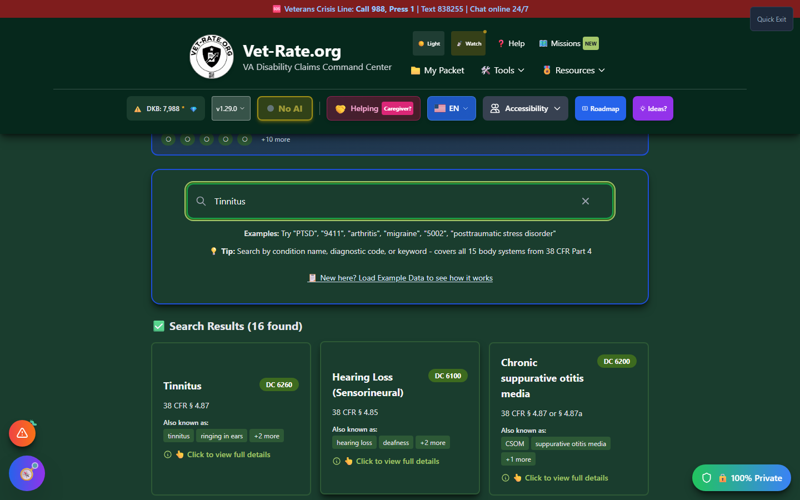

# Search & Explore

The search functionality is the core of Vet-Rate.org, providing access to **748 VA-rated disabilities** with official criteria from 38 CFR Part 4.

_Type a condition name, diagnostic code, or symptom into the search bar to see matching disabilities._

---

## Overview

Vet-Rate.org's search system allows you to find disabilities by:

- **Condition name** - PTSD, arthritis, migraines
- **Diagnostic code** - 9411, 5002, 8100
- **Synonyms** - "ringing in ears", "back pain", "anxiety attacks"
- **Body system** - musculoskeletal, mental health, respiratory

---

## In This Section

<h3>🔍 How to Search</h3>

Master search techniques including auto-suggestions, filters, and advanced queries.

<a href="how-to-search/" class="doc-button">Learn More →</a>

<h3>📋 Search Results</h3>

Understand search result cards and how to interpret the information displayed.

<a href="search-results/" class="doc-button">Learn More →</a>

<h3>📊 Disability Details</h3>

Learn about the expanded detail view including rating criteria, resources, and actions.

<a href="disability-details/" class="doc-button">Learn More →</a>

<h3>📈 Rating Criteria</h3>

Understand how to read and interpret VA rating criteria tables.

<a href="rating-criteria/" class="doc-button">Learn More →</a>

---

## Quick Search Examples

| Search Term       | What You'll Find                      |
| ----------------- | ------------------------------------- |
| `PTSD`            | Post-Traumatic Stress Disorder (9411) |
| `9411`            | PTSD by diagnostic code               |
| `tinnitus`        | Tinnitus (6260)                       |
| `ringing in ears` | Tinnitus via synonym                  |
| `back pain`       | Various spine conditions              |
| `5237`            | Lumbosacral Strain                    |
| `migraine`        | Migraine Headaches (8100)             |
| `sleep apnea`     | Sleep Apnea Syndromes (6847)          |

---

## Body Systems Covered

All 15 body systems from 38 CFR Part 4 are fully searchable:

| System                         | Code Range | Examples                                   |
| ------------------------------ | ---------- | ------------------------------------------ |
| Musculoskeletal                | 5000-5999  | Arthritis, back conditions, joint injuries |
| Organs of Special Sense (Eyes) | 6000-6099  | Vision loss, glaucoma, eye injuries        |
| Auditory (Ears)                | 6100-6299  | Hearing loss, tinnitus, vertigo            |
| Infectious Diseases            | 6300-6399  | Hepatitis, HIV, tuberculosis               |
| Respiratory                    | 6500-6899  | Asthma, COPD, sleep apnea                  |
| Cardiovascular                 | 7000-7199  | Heart conditions, hypertension             |
| Digestive                      | 7200-7399  | GERD, IBS, liver conditions                |
| Genitourinary                  | 7500-7599  | Kidney disease, incontinence               |
| Gynecological                  | 7610-7699  | Endometriosis, related conditions          |
| Hemic/Lymphatic                | 7700-7799  | Anemia, blood disorders                    |
| Skin                           | 7800-7899  | Eczema, scars, skin cancer                 |
| Endocrine                      | 7900-7999  | Diabetes, thyroid conditions               |
| Neurological                   | 8000-8999  | Peripheral neuropathy, nerve damage        |
| Mental Health                  | 9200-9499  | PTSD, depression, anxiety                  |
| Dental/Oral                    | 9900-9999  | Dental conditions                          |

---

## Search Tips

!!! tip "Pro Tips for Better Searches"

    1. **Start broad, then narrow** - Search "knee" before "internal derangement of knee"
    2. **Try multiple terms** - If "back pain" doesn't find it, try "spine" or "lumbar"
    3. **Use diagnostic codes** - If you know the code, search it directly
    4. **Check synonyms** - Medical and common names both work
    5. **Watch suggestions** - Auto-complete often finds what you need
