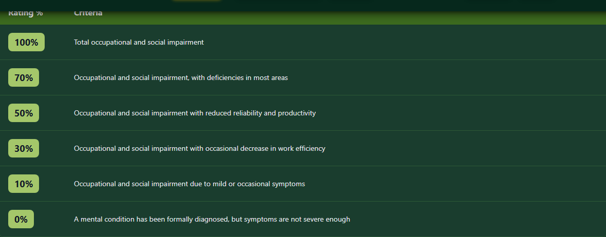

# Rating Criteria

Understanding VA rating criteria is essential for preparing your disability claim. This guide explains how to read and interpret the rating criteria tables in Vet-Rate.org.


_PTSD's rating table under the General Rating Formula for Mental Disorders - each row lists the symptoms required for that percentage._

---

## What Are Rating Criteria?

Rating criteria are the **official standards** the VA uses to evaluate disability severity. They come directly from **38 CFR Part 4** (Schedule for Rating Disabilities).

Each condition has specific criteria that determine:

- What percentage rating you may receive
- What symptoms or impairments are required
- How severity is measured

---

## Types of Rating Systems

### Percentage-Based Ratings

Most conditions use standard percentages:

| Rating   | General Meaning                                   |
| -------- | ------------------------------------------------- |
| **100%** | Total disability / unemployable due to condition  |
| **70%**  | Severe impairment with major functional loss      |
| **60%**  | Significant impairment affecting daily function   |
| **50%**  | Considerable impairment                           |
| **40%**  | Moderate-to-considerable impairment               |
| **30%**  | Moderate impairment                               |
| **20%**  | Mild-to-moderate impairment                       |
| **10%**  | Mild impairment                                   |
| **0%**   | Service-connected, minimal or no current symptoms |

### Range-of-Motion Ratings (Musculoskeletal)

Joint conditions often rate based on how far you can move:

| Joint                | Full ROM | Example 30%    |
| -------------------- | -------- | -------------- |
| Shoulder Flexion     | 180°     | Limited to 90° |
| Knee Flexion         | 140°     | Limited to 45° |
| Lumbar Spine Flexion | 90°      | Limited to 60° |

!!! info "Functional Loss"
Even if your measured range of motion seems adequate, **functional loss due to pain** (per 38 CFR § 4.40 and § 4.45) can warrant a higher rating.

### Formula-Based Ratings

Some conditions use specific formulas:

**Example - Hearing Loss:**

- Uses the Combined Ratings Table
- Based on puretone threshold average and speech discrimination
- Calculated using Tables VI, VIa, and VII

### Analogous Ratings

Some conditions don't have their own code and are "rated as" another condition:

```
"Rate as analogous to [Code] under [Section]"
```

---

## Reading the Criteria Table

### Column Structure

| Column       | Contents                                  |
| ------------ | ----------------------------------------- |
| **Rating %** | The percentage value (100, 70, 50, etc.)  |
| **Criteria** | Detailed description of symptoms required |

### Important Terms

| Term                        | Meaning                                   |
| --------------------------- | ----------------------------------------- |
| **Occupational impairment** | How it affects your ability to work       |
| **Social impairment**       | How it affects relationships/interactions |
| **Total disability**        | Unable to work due to this condition      |
| **Severe**                  | Substantial, significantly limiting       |
| **Moderate**                | Noticeable but not severe                 |
| **Mild**                    | Minor impairment                          |
| **Occasional**              | Sometimes, not constant                   |
| **Chronic**                 | Ongoing, long-term                        |
| **Incapacitating**          | Prevents normal activity                  |

---

## Example: Mental Health Criteria (38 CFR § 4.130)

Mental health conditions (PTSD, depression, anxiety) use the **General Rating Formula for Mental Disorders**:

### 100% Criteria

> Total occupational and social impairment, due to such symptoms as: gross impairment in thought processes or communication; persistent delusions or hallucinations; grossly inappropriate behavior; persistent danger of hurting self or others; intermittent inability to perform activities of daily living; disorientation to time or place; memory loss for names of close relatives, own occupation, or own name.

### 70% Criteria

> Occupational and social impairment with deficiencies in most areas, such as work, school, family relations, judgment, thinking, or mood...

### 50% Criteria

> Occupational and social impairment with reduced reliability and productivity...

### 30% Criteria

> Occupational and social impairment with occasional decrease in work efficiency and intermittent periods of inability to perform occupational tasks...

### 10% Criteria

> Occupational and social impairment due to mild or transient symptoms...

### 0% Criteria

> A mental condition has been formally diagnosed, but symptoms are not severe enough to interfere with occupational and social functioning or to require continuous medication.

---

## Example: Musculoskeletal Criteria (38 CFR § 4.71a)

### Spine Conditions (General Rating Formula)

| Rating   | Criteria                                                                                                                |
| -------- | ----------------------------------------------------------------------------------------------------------------------- |
| **100%** | Unfavorable ankylosis of the entire spine                                                                               |
| **50%**  | Unfavorable ankylosis of the entire thoracolumbar spine                                                                 |
| **40%**  | Unfavorable ankylosis of the entire cervical spine; OR forward flexion of the thoracolumbar spine 30° or less           |
| **30%**  | Forward flexion of cervical spine 15° or less; OR favorable ankylosis of entire cervical spine                          |
| **20%**  | Forward flexion of thoracolumbar spine greater than 30° but not greater than 60°; OR combined ROM not greater than 120° |
| **10%**  | Forward flexion of thoracolumbar spine greater than 60° but not greater than 85°                                        |

### Alternative Rating for IVDS

Intervertebral Disc Syndrome can also be rated based on **incapacitating episodes**:

| Rating  | Incapacitating Episodes (per year) |
| ------- | ---------------------------------- |
| **60%** | At least 6 weeks                   |
| **40%** | At least 4 weeks but less than 6   |
| **20%** | At least 2 weeks but less than 4   |
| **10%** | At least 1 week but less than 2    |

!!! info "What's an Incapacitating Episode?"
An incapacitating episode requires: - Bed rest **prescribed by a physician** - Treatment by a physician

---

## Special Considerations

### DeLuca Factors

For musculoskeletal conditions, examiners must consider:

1. **Pain on movement**
2. **Weakness**
3. **Fatigability**
4. **Incoordination**
5. **Flare-ups** (and estimated additional loss during flares)

### Bilateral Conditions

If you have the same condition on both sides:

- Each side is rated separately
- Combined using the **Combined Ratings Table**
- May receive **bilateral factor** (10% increase)

### Multiple Ratings

Some conditions allow separate ratings for different aspects:

- Example: Spine condition + radiculopathy (nerve damage)
- Example: Knee arthritis + instability

---

## Tips for Using Rating Criteria

!!! tip "Preparation Strategies" 1. **Know your worst days** - VA rates based on your symptoms, not your best day 2. **Document flare-ups** - Keep a symptom journal 3. **Get buddy statements** - Witnesses can describe your limitations 4. **Review DBQ forms** - See what examiners look for 5. **Be specific** - Vague descriptions get lower ratings 6. **Don't minimize** - Describe how bad it actually gets

---

## How Vet-Rate.org Presents Criteria

In the Disability Details view:

1. **Click "📊 Rating Schedules & Criteria"** to expand
2. **Review the rating type** - Percentage, formula, or analogous
3. **Read any special instructions** - "Rated as" or special rules
4. **Study the percentage table** - From highest to lowest
5. **Note any additional instructions** - At the bottom of the section

---

## Validating Criteria

All criteria in Vet-Rate.org are sourced from and validated against:

- **eCFR Title 38, Part 4** - [www.ecfr.gov](https://www.ecfr.gov/current/title-38/chapter-I/part-4)
- **Last validation:** January 2026

For the most current regulations, always verify with the official eCFR.
