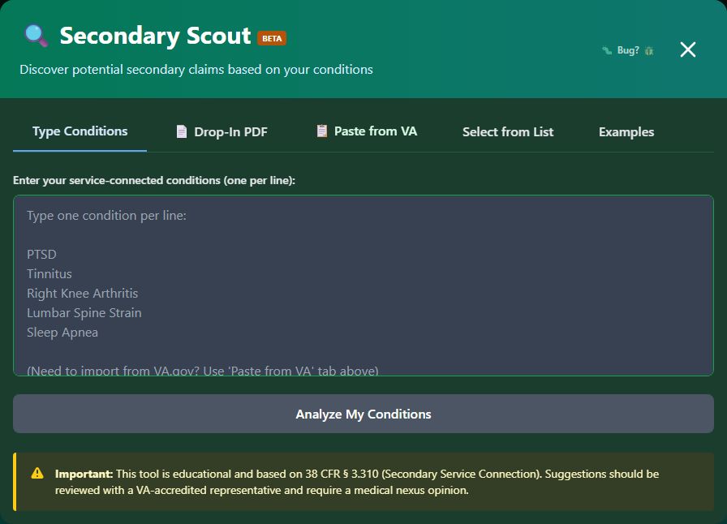

# Launching Secondary Scout

Learn how to start using Secondary Scout to discover potential secondary conditions.

---

## Accessing Secondary Scout

There are multiple ways to launch Secondary Scout:

### From the Header

Click **"🔍 Secondary Scout"** in the navigation header.

### From the Feature Card

On the main page, click the **"🚀 Launch Secondary Scout"** button in the emerald/teal feature card.

### From the Quick Condition Picker

Use the Quick Condition Picker below the feature cards for streamlined access.

---

## The Secondary Scout Launcher

When you open Secondary Scout, you'll see the **Launcher Modal**:

_The launcher opens on the "Type Conditions" tab by default._

The launcher has **five tabs** across the top, each a different way to enter your conditions:

| Tab                  | How It Works                                                                    |
| -------------------- | ------------------------------------------------------------------------------- |
| **Type Conditions**  | Default tab - a textarea where you type one condition per line                  |
| **Drop-In PDF**      | Drag and drop a VA rating decision PDF to extract conditions automatically      |
| **Paste from VA**    | Paste text copied directly from your VA.gov rating decision                     |
| **Select from List** | Browse and check conditions organized by body system (38 CFR Part 4, Subpart B) |
| **Examples**         | Pre-built example condition sets to try the tool quickly                        |

### Entering Your Conditions

<strong>Open the launcher</strong> - Defaults to the "Type Conditions" tab

<strong>Type your conditions</strong> - One service-connected condition per line

<strong>Or switch tabs</strong> - Use Drop-In PDF, Paste from VA, or Select from List instead

<strong>Launch</strong> - Click "Analyze My Conditions"

### Type Conditions Tab

The default tab is a large textarea:

- **One condition per line** - e.g. "PTSD", "Tinnitus", "Right Knee Arthritis"
- **Plain text** - No autocomplete required, though condition names are matched against the database when you launch
- **PDF processed locally** - If you use Drop-In PDF instead, the file never leaves your browser

---

## Search Tips for Conditions

### What to Enter

Enter conditions exactly as they appear on your **VA rating decision letter**:

| Enter             | Example                          |
| ----------------- | -------------------------------- |
| Medical names     | "Post-Traumatic Stress Disorder" |
| Common names      | "PTSD"                           |
| Diagnostic codes  | "9411"                           |
| Body part + issue | "lumbar spine"                   |

### Common Service-Connected Conditions

| Condition       | Also Known As                        |
| --------------- | ------------------------------------ |
| PTSD            | Post-Traumatic Stress Disorder, 9411 |
| Tinnitus        | Ringing in ears, 6260                |
| Hearing Loss    | Bilateral hearing loss               |
| Lumbar Strain   | Low back pain, DDD                   |
| Knee Conditions | Patellofemoral syndrome              |
| Radiculopathy   | Sciatica, nerve pain                 |
| Sleep Apnea     | Obstructive sleep apnea              |
| Migraine        | Migraine headaches                   |

---

## Quick Condition Picker

For faster access, the **Quick Condition Picker** on the main page lets you:

1. **Select from common conditions** - Pre-populated checkboxes
2. **Add custom conditions** - Free-text input
3. **One-click launch** - Go directly to results

### Common Conditions in Quick Picker

- ☑️ PTSD
- ☑️ Tinnitus
- ☑️ Hearing Loss
- ☑️ Low Back Pain
- ☑️ Knee Pain
- ☑️ Sleep Apnea
- ☑️ Migraines
- ☑️ Anxiety
- ☑️ Depression

---

## Minimum Requirements

- **At least 1 condition** required to launch
- **No maximum** - Add as many as you have
- **Must be valid** - Conditions must match the database

---

## What Happens After Launch

After clicking "Analyze My Conditions":

1. **Launcher closes** - Modal disappears
2. **Analysis begins** - System searches nexus database
3. **Results panel opens** - Full-screen results view
4. **Suggestions display** - Cards showing potential secondary conditions

---

## Changing Conditions

After viewing results, you can modify your conditions:

1. Click **"Change Conditions"** button in the results header
2. Return to the launcher
3. Add or remove conditions
4. Re-launch to update results

---

## Returning to Secondary Scout

If you close the results:

- Your conditions are **preserved** during the session
- Re-opening will show your previous results
- Refreshing the page will reset

!!! tip "Save Your Findings"
To preserve your secondary condition discoveries, **add them to My Packet** before closing.
