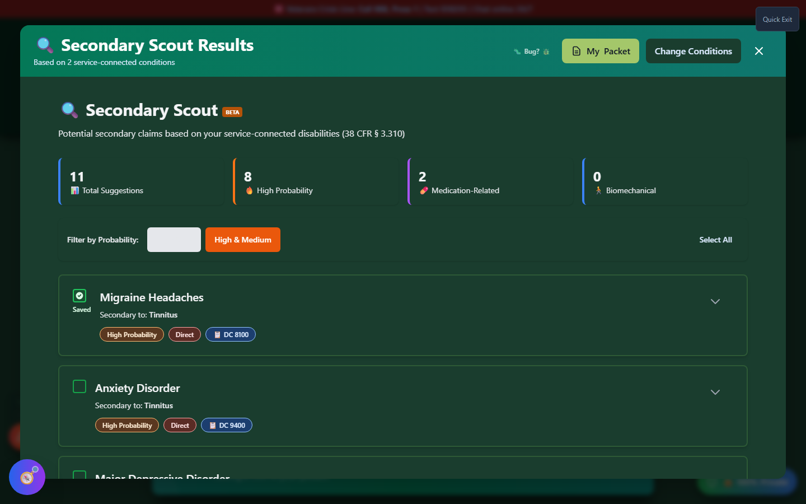
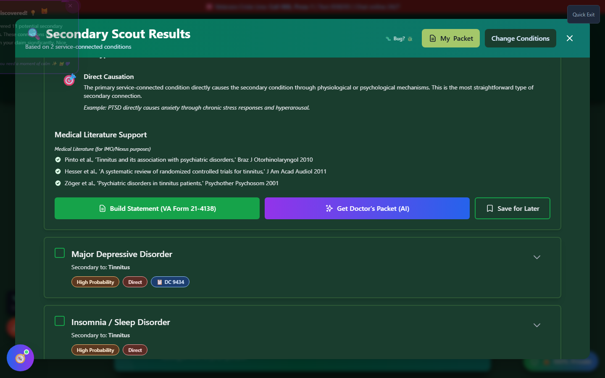

# Understanding Secondary Scout Results

Learn how to interpret the suggestions, mechanisms, and evidence provided by Secondary Scout.

---

## Results Overview

After launching Secondary Scout, you'll see a full-screen results view with:

1. **Header** - Title and action buttons
2. **Statistics Panel** - Summary of findings
3. **Filter Controls** - Probability filtering
4. **Suggestion Cards** - Individual secondary condition suggestions
5. **Disclaimer** - Important legal information

_The full-screen results view, showing 11 total suggestions with 8 rated High Probability._

---

## Statistics Panel

The statistics panel shows four key metrics:

| Stat                      | Description                                          |
| ------------------------- | ---------------------------------------------------- |
| **📊 Total Suggestions**  | Total number of potential secondary conditions found |
| **🔥 High Probability**   | Count of well-established connections                |
| **💊 Medication-Related** | Conditions caused by medications                     |
| **🚶 Biomechanical**      | Conditions from altered gait/compensation            |

---

## Filter Controls

Use the probability filter to focus your review:

### High Only

Shows only **High probability** connections:

- Well-established medical literature
- Strong scientific evidence
- More likely to succeed

### High & Medium

Shows both **High** and **Medium** probability:

- Broader view of possibilities
- May require more evidence
- Worth investigating

---

## Suggestion Cards

Each suggestion is displayed as an expandable card.

### Card Header (Collapsed)

- **Secondary Condition Name** - The potential condition
- **Primary Condition** - What it's connected to ("Secondary to: [condition]")
- **Probability Badge** - High (🔥 orange) or Medium (⚡ yellow)
- **Mechanism Badge** - Type of connection (Direct, Medication, etc.)

### Card Details (Expanded)

Click a card to expand and see:

_Expanding a card reveals the mechanism explanation, supporting medical literature, and three action buttons._

#### Mechanism Explanation

> "How [Primary Condition] leads to [Secondary Condition]"

A plain-language explanation of the medical connection.

#### Nexus Theory

> The medical theory explaining the connection

This section provides:

- The scientific basis for the connection
- Key medical concepts
- Why the VA may accept this link

#### Medical Citations

Supporting medical literature and studies:

- Published research references
- Medical journal articles
- VA-recognized connections

---

## Mechanism Types Explained

### Direct Mechanism

**Color:** Red badge

The primary condition directly causes the secondary:

| Primary     | Secondary    | How                                                  |
| ----------- | ------------ | ---------------------------------------------------- |
| PTSD        | Depression   | Constant trauma symptoms lead to depressive episodes |
| Diabetes    | Neuropathy   | High blood sugar damages nerves                      |
| Sleep Apnea | Hypertension | Oxygen deprivation stresses cardiovascular system    |

### Medication Mechanism

**Color:** Purple badge

Medications for the primary cause the secondary:

| Medication      | For             | Causes                |
| --------------- | --------------- | --------------------- |
| NSAIDs          | Pain management | GERD, stomach ulcers  |
| Steroids        | Inflammation    | Weight gain, diabetes |
| Antidepressants | Mental health   | Sexual dysfunction    |

### Altered Gait Mechanism

**Color:** Blue badge

Compensating for one condition stresses other joints:

| Primary        | Compensation        | Secondary     |
| -------------- | ------------------- | ------------- |
| Knee injury    | Limping             | Hip pain      |
| Ankle injury   | Walking differently | Knee problems |
| Foot condition | Altered stride      | Back pain     |

### Other Mechanisms

- **Inflammation** - Chronic inflammation spreads
- **Sleep** - Sleep disruption cascades
- **Stress** - Chronic stress causes physiological changes
- **Neurological** - Nerve damage spreads

---

## Action Buttons

Each expanded card includes three action buttons:

### Build Statement (VA Form 21-4138)

- Opens the **Nexus Builder** wizard
- Pre-populated with the secondary condition and its primary connection
- Generates a Statement in Support of Claim

### Get Doctor's Packet (AI)

- Opens the AI-powered **Doctor's Packet Generator**
- Creates a medical research brief you can bring to your physician
- See [Doctor's Cheat Sheet](../nexus-builder/doctor-cheat-sheet.md) for details

### Save for Later

- Adds the secondary condition to My Packet
- Tracks it alongside your primary claims
- Button changes to **"Saved (View Packet)"** after clicking - click it again to jump straight to My Packet

---

## Bulk Selection

For efficient workflow with multiple suggestions:

### Selection Checkboxes

- Each card has a **checkbox** in the corner
- Check to select for bulk actions

### Select All

- Click **"Select All"** to select all visible suggestions
- Only selects unsaved conditions

### Clear Selection

- Click **"Clear Selection"** to deselect all

### Floating Action Bar

When conditions are selected, a floating bar appears:

- Shows count of selected items
- **"Add to Packet"** button - Saves all selected
- **"Clear"** button - Clears selection

---

## Understanding Probability Levels

### High Probability 🔥

These connections have:

- ✅ Strong medical literature support
- ✅ Established VA recognition
- ✅ Multiple peer-reviewed studies
- ✅ Logical medical pathway

**Your approach:** Gather medical records and consider a nexus letter.

### Medium Probability ⚡

These connections have:

- ✅ Recognized medical connection
- ⚠️ May need additional evidence
- ⚠️ Less VA precedent
- ✅ Valid medical theory

**Your approach:** Research further, consult with VSO, consider Independent Medical Opinion (IMO).

---

## Tips for Using Results

!!! tip "Maximizing Success"

    1. **Start with High probability** - Best chances of success
    2. **Read the nexus theory** - Understand the medical connection
    3. **Check medical citations** - Research the supporting evidence
    4. **Document your symptoms** - Keep a symptom journal
    5. **Get a nexus letter** - Medical opinion linking conditions
    6. **Save promising findings** - Add to My Packet for tracking
