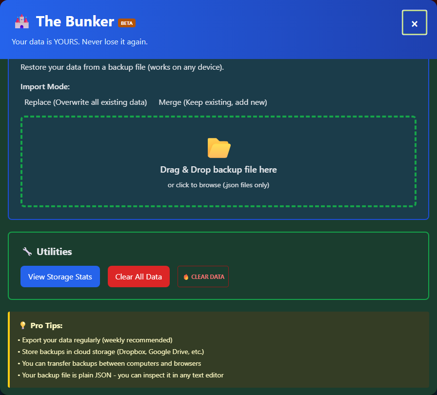
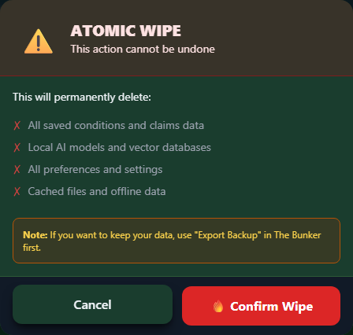

# Data Management

Control how your data is stored, backed up, and managed in Vet-Rate.org.

---

## How Data is Stored

### Local Storage

All your data is stored locally in your browser:

| Data Type           | Storage Location     |
| ------------------- | -------------------- |
| **My Packet**       | Browser localStorage |
| **Settings**        | Browser localStorage |
| **Veteran Profile** | Browser localStorage |
| **Form Drafts**     | Browser localStorage |

### What This Means

- ✅ Data never leaves your device
- ✅ No account required
- ✅ Complete privacy
- ✅ Instant access
- ❌ No sync across devices
- ❌ Data can be lost if browser data is cleared

---

## Checking Storage Usage

### How Much Space?

Browser localStorage typically allows 5-10 MB per site.

Approximate usage:

| Data                        | Typical Size |
| --------------------------- | ------------ |
| Settings                    | <1 KB        |
| Veteran Profile             | 1-2 KB       |
| Per Condition               | 5-15 KB      |
| Per Statement               | 10-30 KB     |
| Full Packet (10 conditions) | 200-400 KB   |

### Checking Usage

The easiest way is in-app - open the **Backup Manager** and click **"View Storage Stats"** in the Utilities section for a breakdown of total keys and size by item, no developer tools required.

You can also check manually in any browser:

1. Open Developer Tools (F12)
2. Go to Application/Storage tab
3. View localStorage usage

---

## Backing Up Data

### Why Backup?

Regular backups protect against:

- Browser data clearing
- Browser reinstall
- Computer changes
- Accidental deletion

### How to Backup

Open <strong>My Packet</strong>

Click <strong>"Local Backup"</strong> in the toolbar

<strong>Save</strong> the JSON file

Store in a <strong>safe location</strong>, or use <strong>Google Drive Sync</strong> for automatic cloud backup

See [Backup & Restore](../my-packet/backup-restore.md) for the fuller **Backup Manager** ("The Bunker"), which adds Google Drive Sync, an HTML Dossier export, and storage utilities.

### Backup Best Practices

!!! tip "Backup Schedule"

    - **Weekly** during active claims work
    - **Before** clearing browser data
    - **Before** major changes
    - **After** adding important content
    - Store **multiple copies** (local + cloud)

---

## Restoring Data

### From Backup File

Open <strong>My Packet</strong> and click <strong>"Restore"</strong>, or open the Backup Manager's <strong>"Import Backup"</strong> section

<strong>Select</strong> your backup file (drag-and-drop works in the Backup Manager)

Choose <strong>Replace</strong> or <strong>Merge</strong>

### Restore Options

| Option      | What Happens                     |
| ----------- | -------------------------------- |
| **Replace** | Backup replaces all current data |
| **Merge**   | Backup data merges with current  |

---

## Clearing Data

The Backup Manager's **Utilities** section has two different clearing options, side by side:

_Storage stats, "Clear All Data," and the compact "🔥 Clear Data" Atomic Wipe trigger._

### Clear All Data

The blue **"Clear All Data"** button removes Vet-Rate's known app data (My Packet, saved forms, profile, settings) after a confirmation step, then reloads the page.

### Atomic Wipe

The red **"🔥 Clear Data"** button opens **Atomic Wipe** - a more thorough wipe that also clears local AI models, vector databases, and cached/offline files, with its own typed confirmation. See the dedicated Atomic Wipe page for the full walkthrough.

_Atomic Wipe's confirmation screen - nothing is deleted until you click "Confirm Wipe."_

### Browser-Level Clear

You can also remove Vet-Rate.org's data through your browser itself:

Open browser <strong>Settings</strong>

Find <strong>"Clear browsing data"</strong> or <strong>"Privacy"</strong>

Select <strong>"Cookies and site data"</strong>

Clear for <strong>vet-rate.org</strong> specifically (if possible)

!!! warning "Backup First!"
Always backup your data before clearing, using Local Backup or Google Drive Sync in the Backup Manager. Both clearing methods above are **irreversible**.

---

## Transferring Data

### To Another Browser

<strong>Export backup</strong> from current browser

Open Vet-Rate.org in <strong>new browser</strong>

<strong>Import backup</strong> in new browser

### To Another Device

<strong>Export backup</strong> from current device

<strong>Transfer file</strong> (email, cloud, USB)

<strong>Import backup</strong> on new device

---

## Privacy Controls

### Data We Don't Collect

Vet-Rate.org does NOT collect:

- ❌ Personal information
- ❌ Personally-identifying usage data
- ❌ Cookies, profiling, or cross-site tracking
- ❌ Your saved content

The only analytics is **GoatCounter** — cookieless, aggregate page views with no
personal identifiers.

### Your Control

You have complete control:

- View all your data (it's in your browser)
- Export all your data
- Delete all your data
- No account to delete

---

## Storage Limits

### Browser Limits

Different browsers have different limits:

| Browser | Typical Limit    |
| ------- | ---------------- |
| Chrome  | 5 MB per origin  |
| Firefox | 10 MB per origin |
| Safari  | 5 MB per origin  |
| Edge    | 10 MB per origin |

### If Storage is Full

If you hit storage limits:

1. Delete old/unused conditions
2. Remove completed forms
3. Export and delete archived data
4. Clear other site data from browser

---

## Troubleshooting

### Data Not Saving

- Check if localStorage is enabled
- Check if private/incognito browsing
- Check available storage space

### Data Disappeared

- Check if browser data was cleared
- Check if you're in a different browser
- Try restoring from backup

### Can't Export Backup

- Check browser download permissions
- Check available disk space
- Try a different browser
