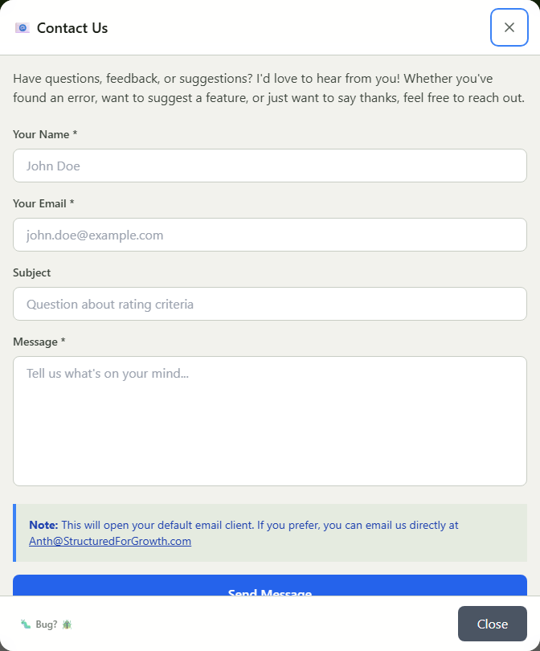

# Contact Us

How to reach the Vet-Rate.org team.

---

## Contact Methods

### In-App Contact Form

The easiest way to reach us:

1. Click **"Contact Us"** in the website footer
2. Fill out the form
3. Click **"Send Message"**

_The form opens your default email client with your message pre-filled, addressed to the team._

!!! info "It Opens Your Email Client"
"Send Message" doesn't submit to a server - it opens a `mailto:` link in your default email app with your name, email, and message already filled in, so you send it from your own inbox. If you don't have a default email app configured, email directly instead.

### Bug Squasher

For technical issues:

1. Click **"🐛 Bug Squasher"** in the footer
2. Describe the issue
3. Submit

---

## What We Can Help With

### ✅ We Can Help With

- Questions about using Vet-Rate.org
- Bug reports
- Feature suggestions
- Data corrections
- Accessibility issues
- General feedback

### ❌ We Cannot Help With

- Official VA claims (contact VA or VSO)
- Medical advice
- Legal advice
- Personal claims assistance
- VA account issues

---

## Response Time

We're a small team, so please allow:

- **Bug reports:** 1-7 days
- **General inquiries:** 3-10 days
- **Feature requests:** Reviewed periodically

We prioritize by:

1. Security issues
2. Critical bugs
3. General bugs
4. Questions
5. Feature requests

---

## Before Contacting

### Check These First

- **Documentation** - Your answer might be here
- **FAQ** - Common questions answered
- **Troubleshooting** - Try basic fixes

### For VA Questions

Contact the VA directly:

- **VA Benefits:** 1-800-827-1000
- **VA Health:** 1-877-222-8387
- **VA.gov** - Online resources

### For Emergencies

🆘 <strong>Veterans Crisis Line:</strong> Call 988, Press 1 | Text 838255 | Available 24/7

---

## What to Include

### General Questions

- Clear description of your question
- What you've already tried
- Any relevant context

### Bug Reports

- What happened
- What should have happened
- Steps to reproduce
- Browser and device info

### Feature Requests

- What feature you'd like
- Why it would be helpful
- How you envision it working

---

## Privacy in Communications

### How This Form Handles Your Message

Since "Send Message" opens your own email client rather than submitting to a server, Vet-Rate.org doesn't receive or store anything until you actually send that email - it's a normal email from that point on, subject to your own email provider's retention, not the app's.

### What We Don't Need

Please don't include:

- Social Security Numbers
- Personal medical details
- Financial information
- Full legal names (first name is fine)

### Secure Communication

If you need to share sensitive information:

- We'll provide secure methods
- Don't include in initial contact

---

## Social Media

Currently, we don't maintain social media accounts. The best way to reach us is through the in-app contact form.

---

## Feedback Welcome

We genuinely appreciate:

- Success stories
- Suggestions
- Constructive criticism
- Ideas for improvement

Your feedback helps make Vet-Rate.org better for all veterans.
